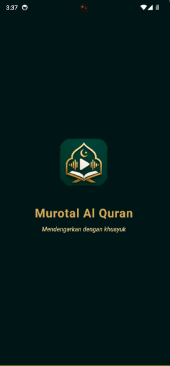
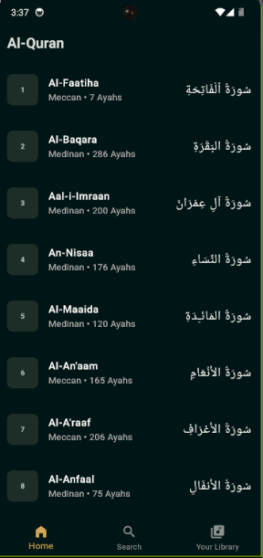
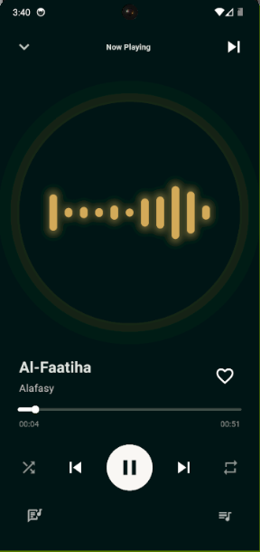
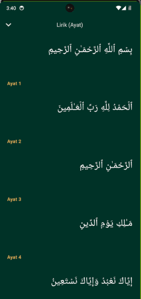
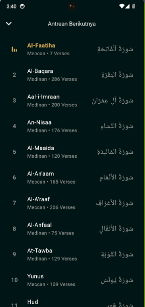
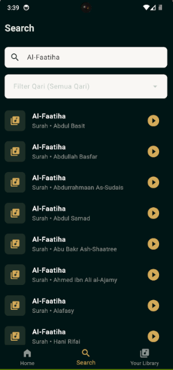
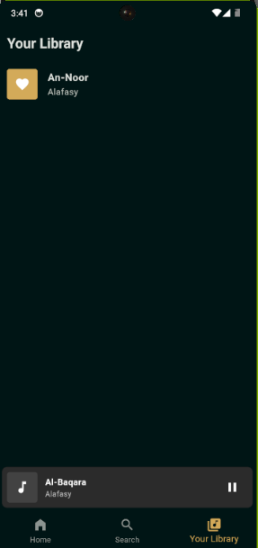
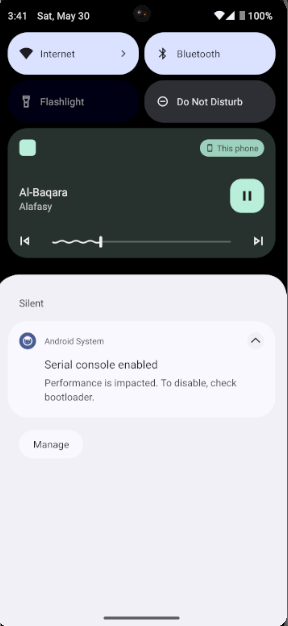

<h1 align="center">
  <br>
  <a href="#"></a>
  <br>
  Murotal Al Quran
  <br>
  “Dengarkan Lantunan Ayat Suci Kapan Saja”
</h1>

## Tentang Aplikasi

Murotal Al Quran adalah aplikasi *mobile* berbasis Flutter yang didesain khusus untuk memberikan pengalaman mendengarkan lantunan ayat suci Al-Quran dengan standar antarmuka premium layaknya aplikasi pemutar musik modern (seperti Spotify). Aplikasi ini dirancang tidak hanya untuk estetika, tetapi juga fungsionalitas tinggi dengan dukungan pemutaran audio di latar belakang (*background service*), manajemen *state* yang kompleks, dan integrasi API waktu-nyata (*real-time*).

Aplikasi ini sangat cocok bagi umat Muslim yang ingin menghafal, mendengarkan, atau sekadar membaca teks ayat Al-Quran secara tersinkronisasi kapan pun dan di mana pun.

## Fitur Utama

- **Advanced Cross-Match Search**: Sistem pencarian canggih yang memungkinkan pengguna memfilter Surah dan *Qari* secara simultan. Mencari "Fatihah" akan mengembalikan hasil Surah Al-Fatihah dari puluhan *Qari* berbeda.
- **Background Audio Service**: Integrasi mendalam dengan sistem operasi Android/iOS untuk memastikan Murotal tetap berjalan mulus di latar belakang (*screen-off*), lengkap dengan kontrol dari *Notification Bar* dan *Lock Screen*.
- **Synchronized Lyrics Reader**: Mode membaca presisi (Lirik) yang menampilkan teks Arab per ayat yang disesuaikan dengan Surah yang sedang didengarkan.
- **Smart Queue & Auto-Play**: Manajemen antrean putar dinamis yang secara otomatis mentransisikan pemutaran ke Surah berikutnya tanpa jeda.
- **Favorites Management**: Sistem *bookmarking* lokal untuk menyimpan kombinasi Surah dan Qari favorit agar dapat diakses secara *offline* melalui *cache*.

## Integrasi API (Alquran.cloud)

Proyek ini sepenuhnya mengandalkan API publik dari [Alquran.cloud](https://alquran.cloud/api) untuk memuat data teks, metadata, dan edisi pembacaan. Berikut adalah rincian *endpoint* yang digunakan:

| Fitur | Endpoint API | Deskripsi |
| :--- | :--- | :--- |
| **Fetch Qaris** | `GET /edition` | Mengambil seluruh entri edisi Al-Quran, kemudian difilter secara spesifik untuk `format=audio` guna mendapatkan daftar *Qari*. |
| **Fetch Surahs** | `GET /surah` | Mengambil metadata kerangka dasar seluruh 114 Surah (Nama Arab, Nama Inggris, jumlah ayat). Digunakan pada *Home Screen*. |
| **Fetch Ayahs/Lyrics** | `GET /surah/{id}/{edition}` | Mengambil detail struktur ayat-per-ayat dari sebuah Surah spesifik berdasarkan edisi pembaca (*edition identifier*). |
| **Audio Streaming** | `GET CDN Network` | Menggunakan *stream* langsung dari CDN Islamic Network: `https://cdn.islamic.network/quran/audio-surah/{bitrate}/{edition}/{id}.mp3`. |

## Arsitektur & Teknologi

Aplikasi ini diimplementasikan menggunakan arsitektur **BLoC (Business Logic Component)** dikombinasikan dengan prinsip **Clean Architecture**. Pemisahan lapisan kode dilakukan secara ketat untuk mempermudah skalabilitas dan pengujian perangkat lunak (*testing*).

### Teknologi yang Digunakan
- **Framework**: Flutter / Dart
- **State Management**: `flutter_bloc`
- **Network / HTTP Client**: `dio` (Konfigurasi *timeout* & *interceptors*)
- **Audio Engine**: `audioplayers` (Pemrosesan sinyal MP3) & `audio_service` (Isolasi audio latar belakang)
- **Local Storage**: `shared_preferences` (Persistensi daftar favorit)
- **Data Equality**: `equatable` (Optimalisasi perbandingan *state* BLoC)

### Struktur Direktori (Clean Architecture)
```text
lib/
├── core/               # Konfigurasi Tema (AppColors), API Network, Audio Handler
├── data/               # Model Entitas JSON dan Repositori (QuranRepository, dll)
├── presentation/       # Lapis Antarmuka
│   ├── blocs/          # Pusat Logika Bisnis (AudioPlayerBloc, QuranBloc, dll)
│   ├── screens/        # Komponen Halaman Penuh (Home, Player, Lyrics)
│   └── widgets/        # Komponen UI Reusable (MiniPlayer, LargeEqualizer)
└── main.dart           # Entry Point & Dependency Injection
```

## UI/UX Design

Desain aplikasi mengusung palet warna *Dark Emerald* (`#013226`) sebagai warna dominan dengan aksen *Premium Gold* (`#D3AA58`), memberikan kesan eksklusif, tenang, dan elegan.

<div align="center">
  </img>
  </img>
  </img>
  </img>
</div>

<br>

<div align="center">
  </img>
  </img>
  </img>
  </img>
</div>

## Kontributor

- **Luthfi Adilal Mahbub** - *Lead Developer* - [GitHub Profile](https://github.com/luthfiadilal)

